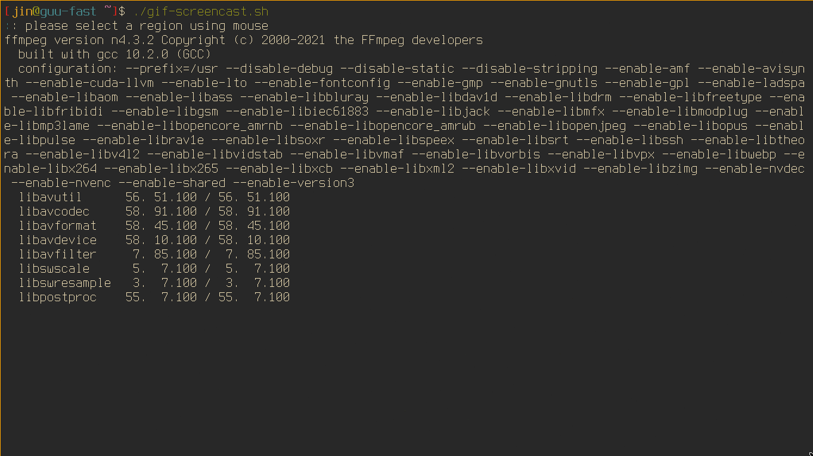

# StumpWM - Dynamic Floating Group

Dynamic tiling + floating support for StumpWM!

## Demo



## Usage

I will try to merge it to the main StumpWM repo after enough
testing. In the meanwhile, connect StumpWM to `swank` or `slynk`,
and evaluate the file in the repl.

## TODOs

+ [X] make every function default at group = (current-group).
      make every function check if input group is a
      dyn-float-group.

+ [X] Free a window when it is controlled my mouse.

+ [X] Add a function to print the dyn-order (state) of the
      (current) group, in order to make the development easier.

+ [ ] Add more commands and keybindings.

+ [ ] `#'re-tile` should respect modeline and boarder.. or even
  gap in the future Waiting for the fix for a related issue for
  general floating group:
  https://github.com/stumpwm/stumpwm/issues/864

+ [ ] Emacs drop-down window.

  + See [`equake`](https://babbagefiles.xyz/equake-elisp-console/).

  + Invoke an emacs window with customized frame.

  ```
  $ emacsclient -c -F '((name . "floating") (width . 150) (height . 10))' \
                -e '(ivy-read "hi" (list (quote a)))'
  ```

## Related issues

+ While moving a floating window from a floating group `g1` to another group
  `g2`, the window isn't removed immediately from `g1` until the user switch
  focus to `g2`. This is a separate issue, and has been reported
  [here](https://github.com/stumpwm/stumpwm/issues/879).
