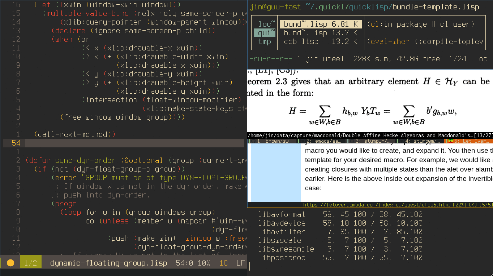
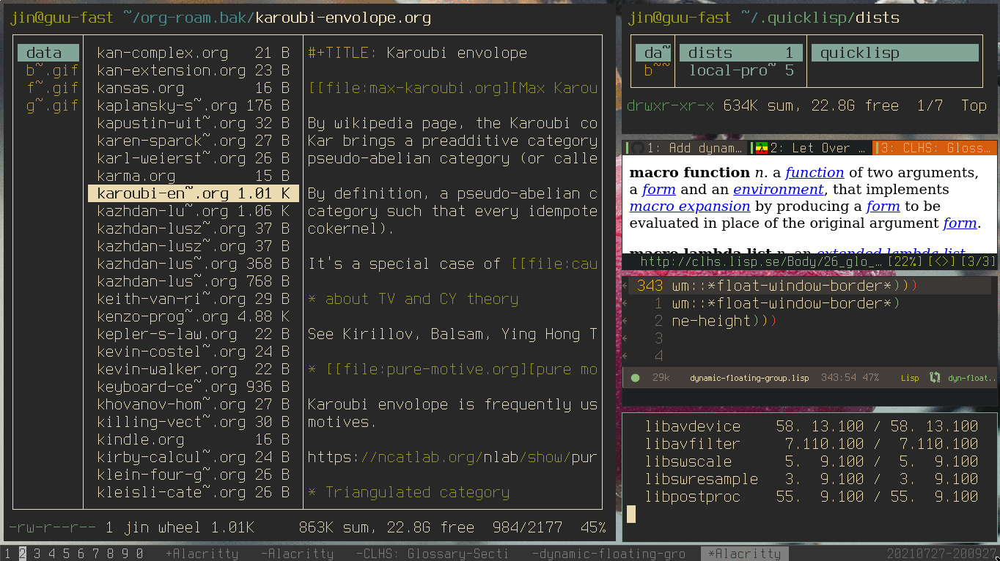

# StumpWM - Dynamic Floating Group

Dynamic tiling + floating support for StumpWM!

## Demo

+ Basic Movement

  

+ Float and Retile

  

+ Layout and Ratio

  

## Usage

I will try to merge it to the main StumpWM repo after enough
testing. In the meanwhile, connect StumpWM to `swank` or `slynk`,
and evaluate the file in the repl.

It's currently waiting to be
[merged](https://github.com/stumpwm/stumpwm/pull/885). Please join discussion
there.

## Documentation

This file `DYN-FLOAT-GROUP` aims to provide a dynamic tiling
experience for floating windows.

This is achieved by letting the group (an instance of the class
`dyn-float-group`) to hold a list of (augmented) windows, and
re-tile accordingly. Here, an augmented window, or a `window+`,
is just a window with some extra information. The list of
augmented windows of a `dyn-float-group` is called a dynamic
order (or `dyn-order`).

The function `#'sync-dyn-order` syncs `dyn-order` with the list
of (ordinary) windows, which is accessible for example by
`(group-windows (current-group))`.

Since each window in a `dyn-float-group` is a `float-window`,
most methods for floating windows work. Most notably, the user
can float and resize the windows by dragging them using the mouse
with `*float-window-modifier*` pressed (default to `:super`).
When a window is floated this way, a method will be called and
set the corresponding augmented window to be free. Freed windows
will not be affected by `#'re-tile`, and are supposed to be put
on the top of the screen. (Note, however, that the window that
are focused or hovered over by the cursor still takes priority,
due to `StumpWM`'s design.) The user can later un-free them by
calling `#'unfree-window` or `#'unfree-all`.

Some methods for floating windows are not compatible with the
intended use of `dyn-float-group` and are therefore banned. They
are

  + `fullscreen`
  + .. (more to come?)

(Note that this is undone yet.)
