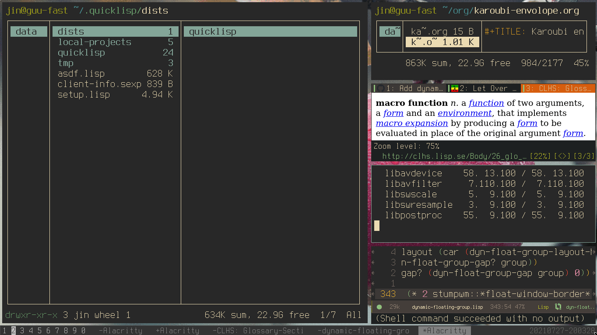

# StumpWM - Dynamic Floating Group

WARNING: Do not delete this repo, as the links to the media here are used in other articles and PRs.

This repo is deprecated, and only serves as a storage for displaying videos.

+ Basic Movement

  

  + move focus
  + permute window
  + fullscreen
  + move single window

+ Float and Retile

  

  + float and resize by `super` + cursor.
  + retile

+ Layout and Ratio

  

  + fullscreen layout + switch focus
  + alter/toggle master ratio
  + left-vertical and horizontal layout

+ Gap

  

  + decrease/increase gap size
  + toggle gap
  + set default gap size
